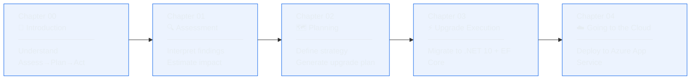

[](./LICENSE)&ensp;
[](https://docs.github.com/copilot)&ensp;
[](https://aka.ms/foundry/discord)

🎯 [What You'll Learn](#-what-youll-learn) &ensp; ✅ [Prerequisites](#-prerequisites) &ensp; 🔧 [The Extension](#-the-github-copilot-app-modernization-extension) &ensp; 📚 [Course Structure](#-course-structure)

# .NET Modernization for Beginners -  WIP

> **✨ Take a legacy ASP.NET app from .NET Framework 4.8 to .NET 10 — using AI.**

You've inherited a legacy .NET app. It works, but it's stuck on .NET Framework 4.8. Security patches are getting scarce, modern libraries won't install, and your team can't use the latest language features. Modernizing feels overwhelming: breaking changes, deprecated APIs, package incompatibilities. This course shows you how to do it systematically using the GitHub Copilot modernization agent — an AI-powered assistant that assesses your code, plans the migration, and helps you execute it step by step.

This course is artifact-first. Instead of only showing mechanics, it teaches you how to read assessment reports and upgrade plans as decision tools: what to fix first, where risk is concentrated, and how to stage execution with confidence.

This course is designed for:
- **.NET developers on legacy stacks** — If you're maintaining apps on .NET Framework 4.x, .NET Core 3.1, or .NET 5–7, you'll learn a repeatable upgrade process that works for real-world codebases.
- **Teams planning a migration** — You'll understand the assessment-first approach: how to identify blockers, estimate effort, and prioritize fixes before touching code.
- **Developers new to the GitHub Copilot modernization agent** — You've used GitHub Copilot for code completion, but this agent is purpose-built for .NET migrations. You'll learn how it differs and when to use it.

## 🎯 What You'll Learn

You'll walk through the full modernization lifecycle: assess a legacy ASP.NET MVC 5 application (the BookCatalog app in this repo), interpret its compatibility report, resolve breaking changes, target .NET 10, and deploy the modernized app to Azure. By the end, you'll have a repeatable workflow you can apply to your own legacy codebases.

You will also learn a practical interpretation model for modernization artifacts:
- How to translate findings into priorities and sequencing
- How to separate assessment outputs from planning outputs
- How to use execution checkpoints to reduce migration risk

## ✅ Prerequisites

| Requirement | Version / Notes |
|-------------|-----------------|
| **Windows** | Windows 11 (22H2 or later) |
| **Visual Studio** | 2026 |
| **GitHub Copilot subscription** | Active subscription required |
| **.NET Framework 4.8 SDK** | Required to run the legacy sample app |
| **.NET 10 SDK** | Preview or latest release |
| **Git** | Any recent version |
| **Prior experience** | C#, ASP.NET, Git, NuGet fundamentals |

> ⚠️ **Note:** This course covers the Visual Studio workflow, which requires Windows. The agent also [runs](https://learn.microsoft.com/dotnet/core/porting/github-copilot-app-modernization/install?pivots=vscode) in VS Code, GitHub Copilot CLI, and the GitHub Copilot app for cross-platform use — but those paths are not covered here.

## 🔧 GitHub Copilot Modernization

The GitHub Copilot modernization agent is available in Visual Studio, VS Code, GitHub Copilot CLI, and the GitHub Copilot app. It automates .NET migration analysis and code updates. Here's where it fits in the Copilot ecosystem:

| Tool | Purpose | When to Use It |
|------|---------|----------------|
| **GitHub Copilot (code completion)** | Autocomplete code as you type | Daily coding in any language |
| **GitHub Copilot Chat** | Answer questions, generate snippets | When you need explanations or quick code samples |
| **GitHub Copilot modernization agent** | Assess, plan, and modernize .NET apps | When upgrading legacy .NET codebases to modern frameworks |

This course focuses on the third tool: the agent that specializes in .NET migrations. It runs in Visual Studio, VS Code, GitHub Copilot CLI, and the GitHub Copilot app — this course covers the Visual Studio workflow.

## 📚 Course Structure



| Chapter | Title | What You'll Do |
|:-------:|-------|----------------|
| **00** | 🧭 [Introduction](./00-introduction/README.md) | Get started with the agent, understand the 3-phase model (Assess → Plan → Act), and run your first assessment on a standalone sample. |
| **01** | 🔍 [Assessment](./01-assessment/README.md) | Open the BookCatalog legacy app, run the compatibility assessment, and interpret blockers vs. warnings using report artifacts. |
| **02** | 🗺️ [Planning](./02-planning/README.md) | Turn assessment findings into strategy decisions, ordered tasks, and execution gates using plan artifacts. |
| **03** | ⚡ [Upgrade Execution](./03-upgrade-execution/README.md) | Execute the extension's Act workflow to migrate BookCatalog to .NET 10, review AI-generated code suggestions, resolve compilation errors, and verify the upgrade. |
| **04** | ☁️ [Going to the Cloud](./04-cloud/README.md) | Use the extension's cloud-migration flow to deploy the modernized BookCatalog app to Azure, verify the deployment, and clean up resources. |

> 📌 **Course status:** Chapters **00-04** are actively maintained and aligned to the same artifact-first workflow: assess, plan, execute, and validate.

## 📖 How This Course Works

**Chapters are sequential.** Chapter 01 assesses the app, Chapter 02 turns findings into a plan, Chapter 03 executes the upgrade, and Chapter 04 deploys the modernized output to Azure. Don't skip ahead.

Clone this repo and follow the steps in each chapter's README:

```bash
git clone https://github.com/microsoft/dotnet-modernization-for-beginners.git
cd dotnet-modernization-for-beginners
```

Each chapter includes step-by-step instructions, code samples, expected outputs, and troubleshooting tips. The `shared-legacy-app/` folder contains the BookCatalog app used in Chapters 01-04.

## 🙋 Getting Help

- **Issues:** Found a bug or unclear instruction? [Open an issue](https://github.com/microsoft/dotnet-modernization-for-beginners/issues).
- **Docs:** [GitHub Copilot documentation](https://docs.github.com/copilot) | [.NET 10 migration guide](https://learn.microsoft.com/dotnet/core/whats-new/dotnet-10) | [GitHub Copilot modernization documentation](https://aka.ms/ghcp-modernization/dotNET)
- **Community:** Join the [Azure AI Discord](https://aka.ms/foundry/discord) to connect with other developers.

## Contributing

Contributions are welcome! See [CONTRIBUTING.md](CONTRIBUTING.md) for guidelines.

## License

MIT. See [LICENSE](LICENSE) for details.

---

**[Start Here: Chapter 00 →](./00-introduction/README.md)**
